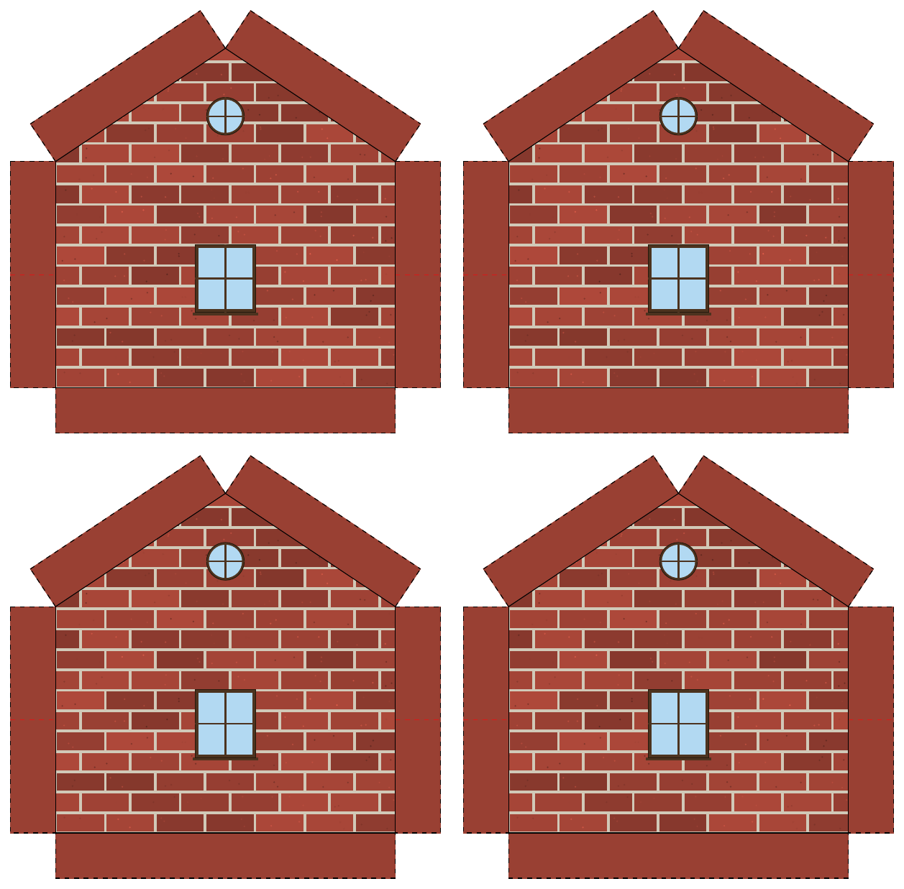
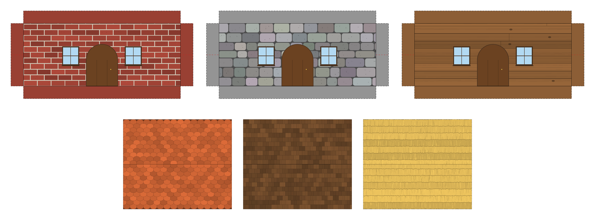
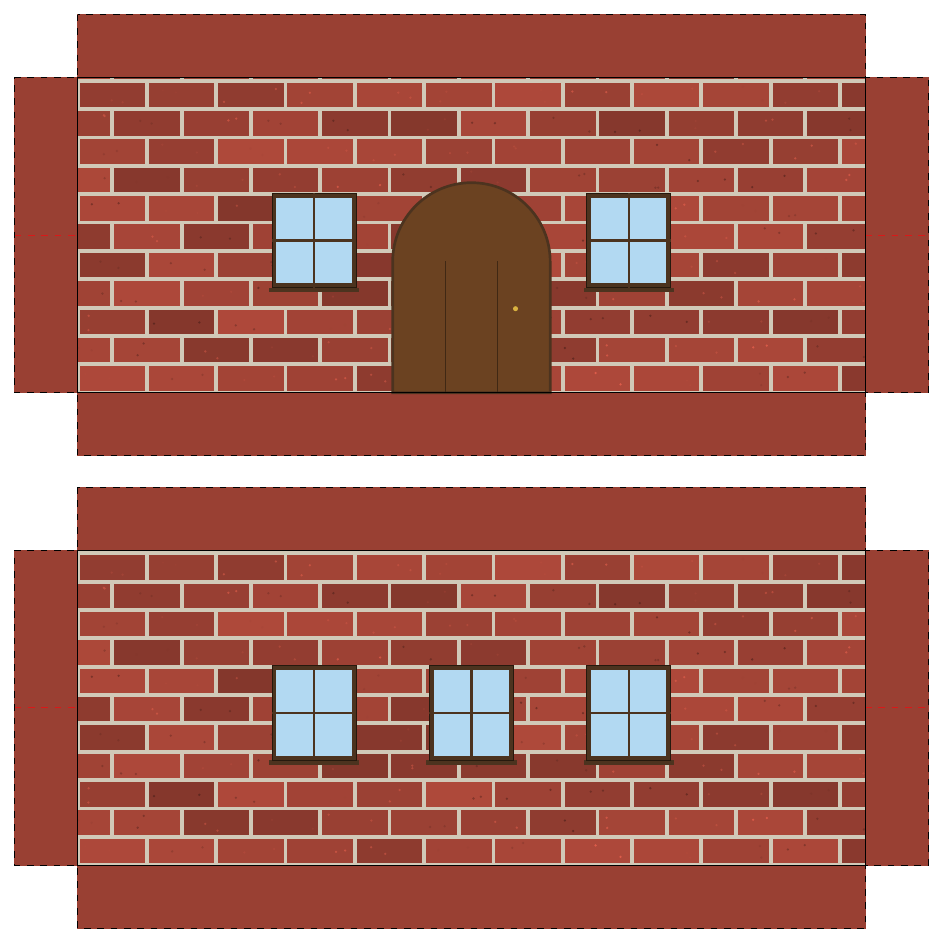
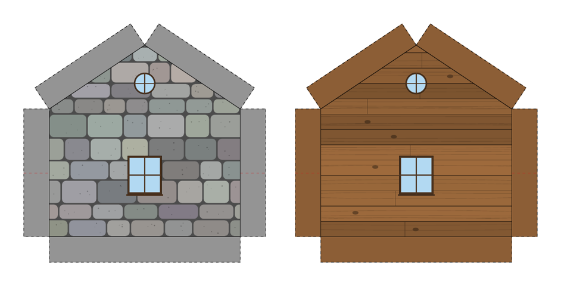
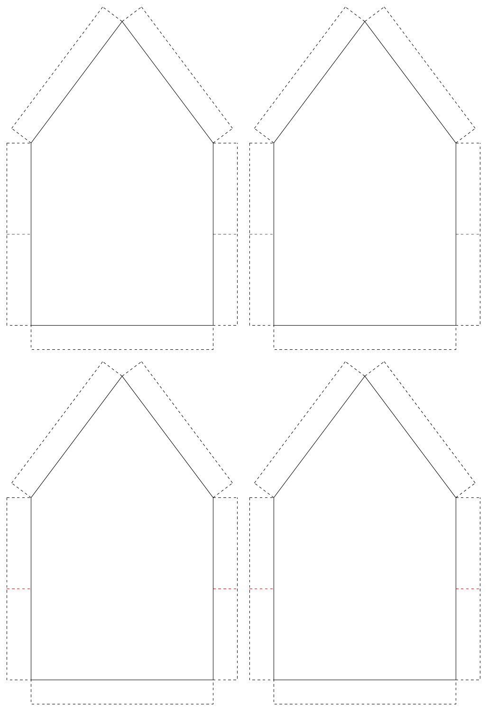

# Paper Houses

Procedural, printable paper houses for tabletop RPGs (built for D&D 5e).

A single Python script draws the cutting and folding templates for a small house, **sized on the 2.5 cm battle-map grid**, and paints them with procedurally generated textures (brick, stone or wood walls; tile, wood or thatch roofs), complete with a door and windows. Everything is drawn as vector graphics straight into the PDF, so it stays sharp at any print size and needs nothing but `reportlab`.



## Features

- **Grid-accurate**: wall sizes are the *inner* rectangle, measured in 2.5 cm game squares. The 1 cm tabs are added outside and never count towards the house size.
- **Procedural textures**, deterministic for a given `SEED`:
  - Walls: brick, stone, wood (horizontal planks)
  - Roofs: wood shingles, clay tiles, thatch
  - Textures only cover the area inside the solid lines. Tabs get the flat base colour only, which makes cutting and gluing easier.
- **Door and windows scaled to the story world**: 2.5 cm = 1.5 m, so a 5 cm wall is a 3 m, single-storey wall. Doors are 1 m to 1.5 m wide depending on the wall length, windows are 0.8 x 0.9 m.
- **Door on the short or the long side**, your choice.
- **Whole-house mode**: generates the short wall (with the roof gable), the long wall and the roof sheet, as three separate PDFs plus one combined A4 PDF.
- **Smart A4 packing**: each sheet of the combined PDF is an A4 page with as many copies of the same piece as fit (1, 2 or 4), in the best orientation.
- **One door per house**: when several copies of the door wall share a sheet, only half of them get a door (the others get a window in its place). Can be disabled.
- **Warnings** at runtime if a wall size is not a multiple of 2.5 cm.
- Optional: generate all 9 wall/roof material combinations in one run.

## Gallery

Wall and roof materials (top: brick, stone, wood walls; bottom: tiles, wood, thatch roofs):



The long wall carries the door. With the "one door per house" option, the second copy on the sheet gets a window instead:



The short wall (with the roof gable and its round window) in stone and in wood:



## How to read the sheets

| Line | Meaning |
| --- | --- |
| Solid black | **Fold** |
| Dashed black | **Cut** |
| Dashed red, half-way up each side tab | Marks where to cut for the interlocking joint |

The corners between two side tabs are left blank: they are cut away and do not appear in the folded house. The dashed outline follows the resulting cross shape.

With textures disabled (`TEXTURE_ATTIVE = False`) you get just the line templates:



## Scale

| Value | Meaning |
| --- | --- |
| 2.5 cm | one game square, 1.5 m in the fiction |
| 5 cm wall height | 3 m, one storey |
| 7.5 x 12.5 cm footprint (default) | 3 x 5 squares |

## Requirements

- Python 3.10+
- [ReportLab](https://pypi.org/project/reportlab/)

```bash
pip install reportlab
```

## Usage

```bash
python main.py
```

By default this writes four PDFs in the current folder:

| File | Content |
| --- | --- |
| `casa_DnD_lato_corto.pdf` | Short wall with the roof gable, sized to the piece |
| `casa_DnD_lato_lungo.pdf` | Long wall, sized to the piece |
| `casa_DnD_tetto.pdf` | Roof sheet, two slopes folded along the ridge |
| `casa_DnD_completo.pdf` | The three pieces on A4 pages, several copies per page |

A complete house needs **2 short walls, 2 long walls and 1 roof**. On the default A4 sheets this means one page of short walls (4 per page), one of long walls (2 per page, one with a door) and one of roofs (2 per page).

If a PDF cannot be written (`PermissionError` on Windows), the file is almost always still open in a PDF viewer. Close it and run the script again.

## Configuration

All settings are constants at the top of `main.py`. The names are still Italian and will be renamed when the code is translated.

| Setting | Default | What it does |
| --- | --- | --- |
| `GENERA_CASA_INTERA` | `True` | Whole house (4 PDFs) or a single wall PDF |
| `LARGHEZZA_CM` | `7.5` | Short wall inner width (3 squares) |
| `LUNGHEZZA_CM` | `12.5` | Long wall inner width (5 squares) |
| `ALTEZZA_CM` | `5.0` | Wall inner height (2 squares) |
| `BORDO_CM` | `1.0` | Tab width around the inner rectangle |
| `ALTEZZA_TETTO_CM` | `2.5` | Height of the roof gable |
| `ALETTA_CM` | `1.0` | Width of the roof flaps on the gable |
| `SPORGENZA_TETTO_CM` | `0.5` | How far each roof slope overhangs the gable side |
| `MARGINE_TETTO_CM` | `1.0` | Extra margin added on every side of the roof sheet |
| `TEXTURE_ATTIVE` | `True` | Textures on or off |
| `MATERIALE_PARETE` | `"mattoni"` | `"mattoni"` (brick), `"pietra"` (stone), `"legno"` (wood) |
| `MATERIALE_TETTO` | `"tegole"` | `"tegole"` (tiles), `"legno"` (wood), `"paglia"` (thatch) |
| `GENERA_TUTTE_LE_VARIANTI` | `False` | Generate all 9 material combinations |
| `SEED` | `7` | Different seed, different variation of the same textures |
| `PORTA_E_FINESTRE` | `True` | Draw door and windows |
| `PORTA_SU` | `"lungo"` | Door on the `"corto"` (short) or `"lungo"` (long) side |
| `DIMEZZA_PORTE_COPIE` | `True` | Only half of the door-wall copies on a sheet get a door |
| `COLORE_INDICATORE` | red | Colour of the half-height mark on the side tabs |
| `MARGINE_A4_CM`, `SPAZIO_COPIE_CM` | `0.5` | Page margin and gap between copies on A4 |

Door and window sizes are set in metres of the fiction (`PORTA_L_MIN_M`, `PORTA_L_MAX_M`, `PORTA_A_M`, `FINESTRA_L_M`, `FINESTRA_A_M`, `FINESTRA_DAVANZALE_M`) and converted with `CELLA_CM` and `METRI_PER_CELLA`.

## Printing and assembly

- Print at **100% / "actual size"**, never "fit to page". Otherwise the pieces will not match the 2.5 cm grid. A quick check: the inner rectangle of the short wall should measure exactly 7.5 cm.
- Cut along the dashed lines and fold along the solid ones.
- Thick paper or light card works best.

## Known limitations

- The red half-height mark is hard to see on the red brick tabs. Change `COLORE_INDICATORE` if you use that material.
- The combined A4 PDF only packs 1, 2 or 4 copies per page. Other layouts can be added to `DISPOSIZIONI`.
- Textures are drawn procedurally and are not meant to look photographic.

## Roadmap

- Translate the code (identifiers, comments, console output) to English
- More materials and window styles
- Optional second storey for larger walls
